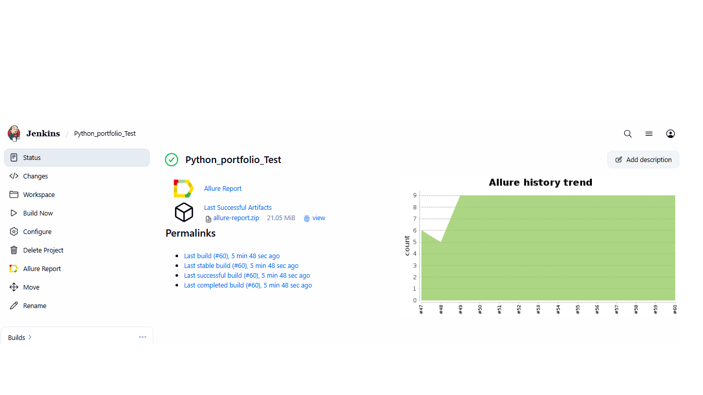
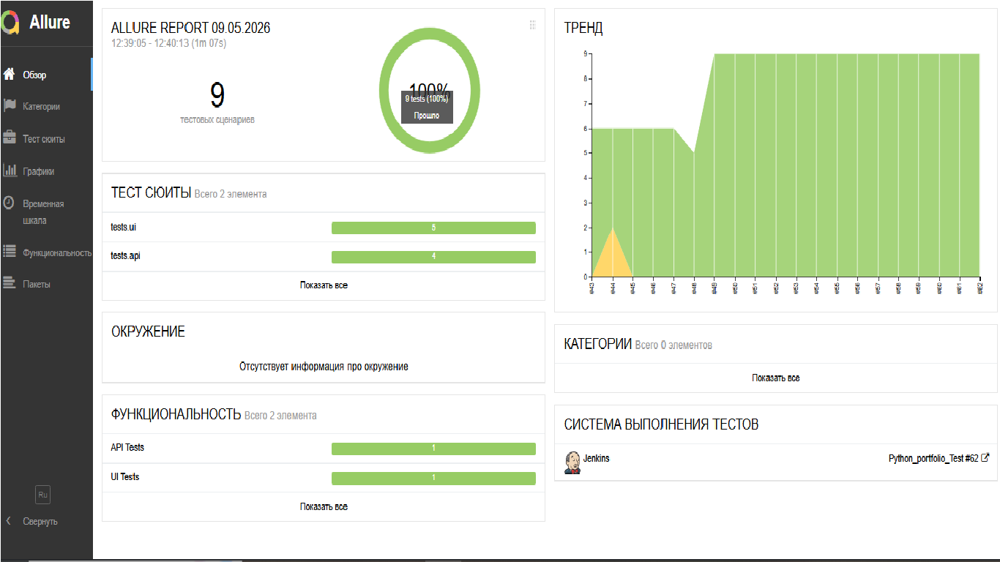
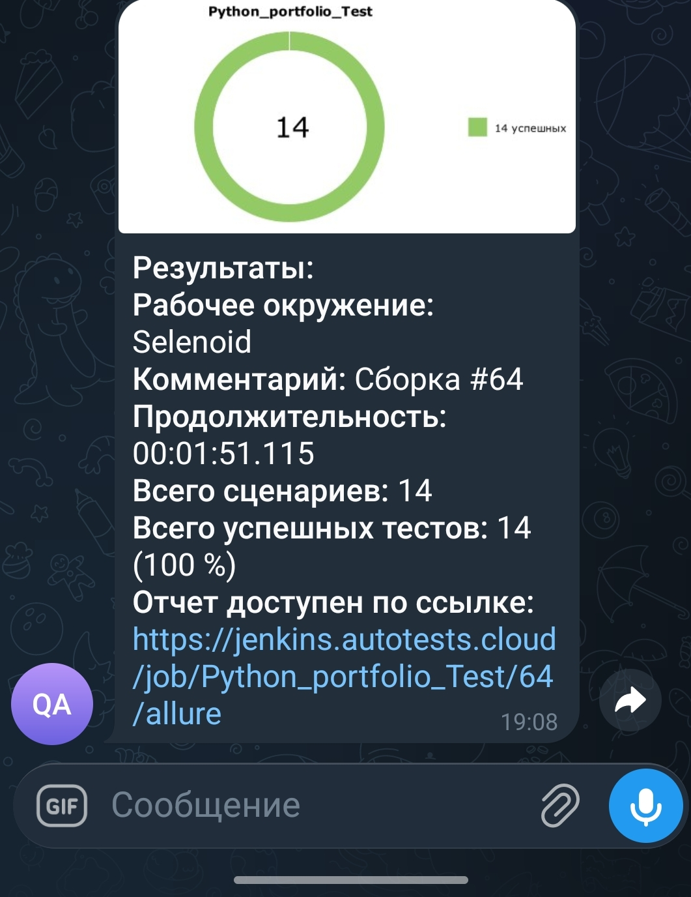

<h1 align="center">
  🚀 Привет, я Дмитрий<br>
  🧪 QA Automation Engineer<br>
  🐍 Python разработчик<br>
  ⚡ API + UI тестирование
</h1>

<h3 align="center">
  👨‍💻 QA Automation Engineer | Python | Selenium | API Testing
</h3>

<p align="center">
  
  <a href="https://t.me/qa_guru_ivantsov_bot">
    
  </a>
</p>

<p align="center">
  <a href="https://jenkins.autotests.cloud/job/Python_portfolio_Test/">
    
  </a>
  <a href="https://github.com/1DimonNT/Python_portfolio">
    
  </a>
</p>

---

## 🔧 Инструменты
<p align="center">
  🐍 Python &nbsp;&nbsp;|&nbsp;&nbsp;
  🧪 Selenium &nbsp;&nbsp;|&nbsp;&nbsp;
  🔧 Jenkins &nbsp;&nbsp;|&nbsp;&nbsp;
  📊 Allure &nbsp;&nbsp;|&nbsp;&nbsp;
  🐳 Docker &nbsp;&nbsp;|&nbsp;&nbsp;
  📦 Git &nbsp;&nbsp;|&nbsp;&nbsp;
  ✅ Pytest &nbsp;&nbsp;|&nbsp;&nbsp;
  📡 Requests
</p>

---

## 📁 Проект: Test Automation Framework

Демонстрационный проект, показывающий навыки автоматизации тестирования. Фреймворк покрывает **UI** и **API** тесты с подробными Allure-отчётами.

### 🎯 Цель проекта

Автоматизация тестирования веб-приложения **SauceDemo** и **JSONPlaceholder API** с использованием современных инструментов и подходов к тестированию.

### 🔧 Стек технологий

| Категория | Технологии |
|-----------|------------|
| **Язык** | Python 3.12 |
| **Фреймворки** | Pytest, Selenium |
| **API тесты** | Requests |
| **Отчеты** | Allure Framework |
| **CI/CD** | Jenkins |
| **Контейнеризация** | Selenoid, Docker |
| **Управление тестами** | Allure TestOps |
| **Баг-трекинг** | Jira |
| **Уведомления** | Telegram Bot |

---

## 🏗️ Архитектура проекта

```text
Python_portfolio/
├── api/                      # API клиент и модели
│   ├── client.py             # Базовый HTTP клиент
│   ├── models.py             # dataclass модели
│   └── posts_api.py          # API методы для /posts
├── config/                   # Конфигурация
│   └── settings.py           # Настройки из .env
├── models/                   # Модели данных для UI
│   └── user.py               # Пользовательские данные
├── pages/                    # Page Object Model
│   ├── base_page.py          # Базовый класс
│   ├── login_page.py         # Страница логина
│   ├── products_page.py      # Страница товаров
│   ├── cart_page.py          # Страница корзины
│   └── checkout_page.py      # Страница оформления
├── tests/                    # Тесты
│   ├── api/                  # API тесты (7 шт)
│   │   └── test_posts_api.py
│   ├── ui/                   # UI тесты (7 шт)
│   │   └── test_saucedemo.py
│   └── conftest.py           # Фикстуры и хуки
├── utils/                    # Утилиты
│   └── attach.py             # Allure аттачменты
├── notifications/            # Telegram уведомления
│   ├── allure-notifications-4.11.0.jar
│   └── config.json
├── images/                   # Скриншоты для README
│   ├── jenkins-build.png
│   ├── allure-report.png
│   └── telegram-notifications.jpg
├── .env.example              # Пример переменных окружения
├── .gitignore                # Игнорируемые файлы
├── pytest.ini                # Настройки pytest
├── requirements.txt          # Зависимости
└── README.md                 # Документация
```

---

## ✅ Тестовое покрытие

### 🌐 UI Тесты (SauceDemo) — 7 тестов

| Сценарий | Статус |
|----------|--------|
| Успешный логин | ✅ |
| Логин с неверным паролем | ✅ |
| Сортировка товаров по цене | ✅ |
| Добавление товара в корзину | ✅ |
| Оформление заказа | ✅ |
| Проверка счетчика корзины | ✅ |
| Минимальный checkout | ✅ |

### 🔌 API Тесты (JSONPlaceholder) — 7 тестов

| Метод | Эндпоинт | Статус |
|-------|----------|--------|
| GET | /posts | ✅ |
| GET | /posts/{id} | ✅ |
| GET | /posts?userId={id} | ✅ |
| POST | /posts | ✅ |
| PUT | /posts/{id} | ✅ |
| DELETE | /posts/{id} | ✅ |
| Проверка существования | /posts/{id} | ✅ |

---

## 🚀 Запуск проекта

### 1. Клонирование и установка

```bash
git clone https://github.com/1DimonNT/Python_portfolio.git
cd Python_portfolio
python -m venv .venv

# Windows
.venv\Scripts\activate

# Linux/Mac
source .venv/bin/activate

pip install -r requirements.txt
```
### 2. Настройка окружения

Создайте файл `.env` по примеру из `.env.example`:

```bash
cp .env.example .env
```
Заполни переменные:
```bash
SELENOID_URL=your_selenoid_url
SELENOID_USER=your_username
SELENOID_PASSWORD=your_password
BASE_URL=https://www.saucedemo.com
BROWSER=chrome
BROWSER_VERSION=128.0
WINDOW_SIZE=1920,1080
TIMEOUT=30
```
---

## 🔧 Jenkins Pipeline

Проект настроен на автоматический запуск в Jenkins при пуше в GitHub.

### 📋 Параметры сборки

| Параметр | Значение |
|----------|----------|
| **Репозиторий** | [Python_portfolio](https://github.com/1DimonNT/Python_portfolio) |
| **Ветка** | `main` |
| **Агент** | `python3-jenkins-agent-1` |
| **Selenoid URL** | `selenoid.autotests.cloud/wd/hub` |

### ⚙️ Build Steps

```bash
#!/bin/bash
# Установка зависимостей
python3 -m venv venv
. venv/bin/activate
pip install -r requirements.txt

# Запуск тестов на Selenoid
export SELENOID_URL="selenoid.autotests.cloud/wd/hub"
export SELENOID_USER="user1"
export SELENOID_PASSWORD="1234"
export BASE_URL="https://www.saucedemo.com"

pytest tests/ --alluredir=allure-results -v

# Ожидание генерации видео
sleep 10
```
### Jenkins Build

<p align="center">
  
</p>

### Allure Report

<p align="center">
  
</p>

### Telegram Notifications

<p align="center">
  
</p>
---
### 3. Запуск тестов

# Все тесты
```bash
pytest -v
```
# Только UI тесты
```bash
pytest tests/ui/ -v
```
# Только API тесты
```bash
pytest tests/api/ -v
```
# Smoke тесты
```bash
pytest -m smoke -v
```
---
### 4. Просмотр Allure-отчёта
```bash
# Запуск с генерацией результатов
pytest --alluredir=allure-results -v

# Просмотр отчета
allure serve allure-results
```
## 📊 Отчётность

### Что входит в Allure-отчёт:

| Компонент | Описание |
|-----------|----------|
| 📸 Скриншоты | Финальное состояние страницы после теста |
| 🎬 Видео | Полная запись выполнения теста (Selenoid) |
| 📄 HTML | Page Source для отладки |
| 📋 Логи | Консольные логи браузера |
| 📝 API логи|	Request/Response для каждого запроса

🤖 Интеграции
Инструмент	Назначение	Ссылка
Jenkins	CI/CD	Dashboard
Allure TestOps	Тестовая документация	TestOps
Jira	Баг-трекинг	Jira
Telegram	Уведомления	Bot

## 📱 Telegram-уведомления

После каждой сборки в Jenkins результаты естов автоматически отправляются в Telegram с графиком прохождения и ссылкой на Allure-отчёт.

### 📸 Пример уведомлений:

<p align="center">
  
</p>

*На скриншоте: сборка #44 (⚠️ 4 passed, 2 failed) и сборка #45 (✅ 6 passed). Бот показывает красный график при ошибках и зелёный при 100% прохождении.*

### 🔧 Используемые технологии:

| Компонент | Технология |
|-----------|------------|
| CI/CD | Jenkins |
| Отправка | Telegram Bot API |
| График | allure-notifications.jar v4.11.0 |

### 🔗 Ссылки:

- [📊 Allure Dashboard](https://jenkins.autotests.cloud/job/Python_portfolio_Test/allure/)
- [🤖 Telegram Bot](https://t.me/qa_guru_ivantsov_bot)

## 📈 Результаты

### Последние сборки в Jenkins:

| Сборка | Всего | Passed | Failed | Проходимость | Отчет |
|--------|-------|--------|--------|--------------|-------|
| #61 | 14    | 14     | 0 | 100% ✅ | [Allure](https://jenkins.autotests.cloud/job/Python_portfolio_Test/61/allure) |
| #51 | 14    | 14     | 0 | 100% ✅ | [Allure](https://jenkins.autotests.cloud/job/Python_portfolio_Test/51/allure) |

### Общая статистика проекта:

| Показатель | Значение |
|------------|----------|
| Всего тестов | 14 |
| UI тестов | 7 |
| API тестов | 7 |
| Ожидаемая проходимость | 100% ✅ |

